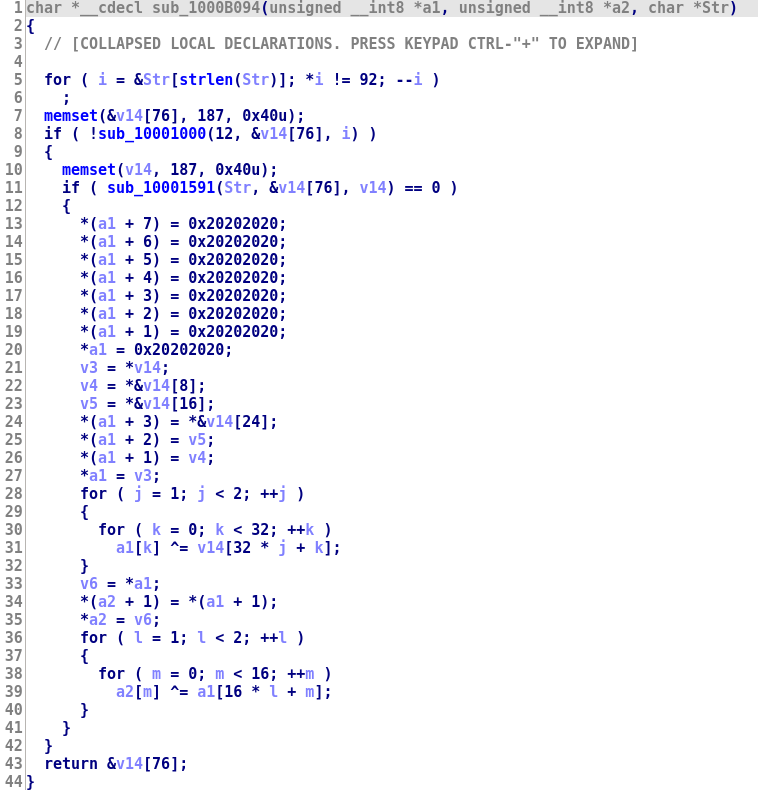
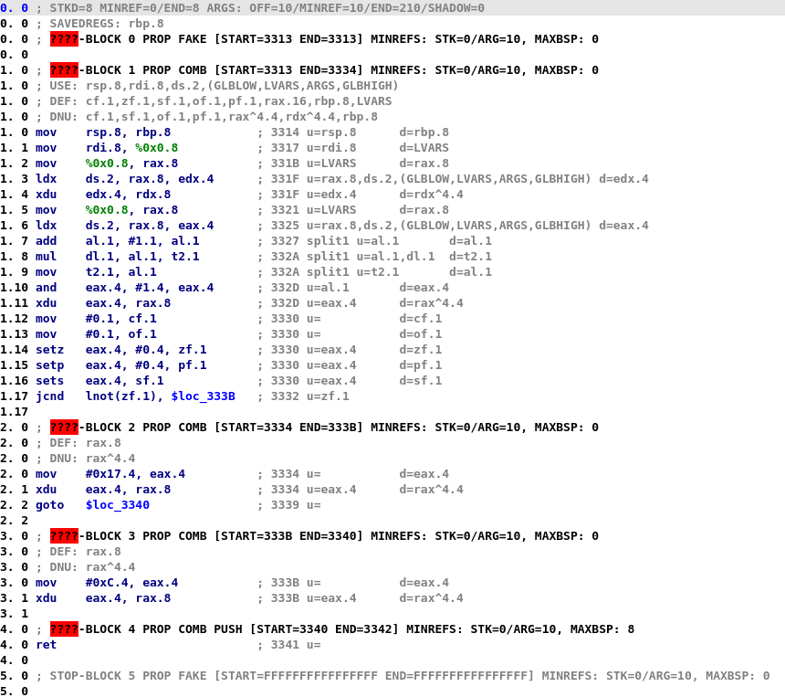
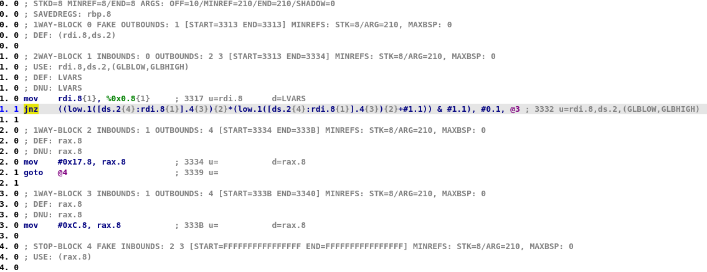
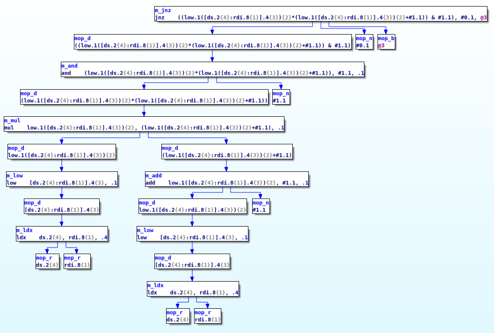
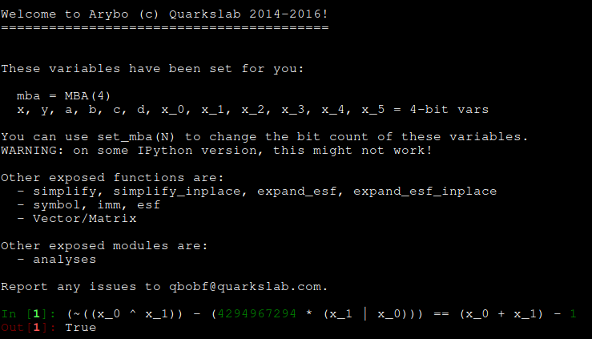

> 原文地址 [eshard.com](https://eshard.com/posts/d810_blog_post_1/)

# D810: Creating an extensible deobfuscation plugin for IDA Pro

During our day to day tasks, we often have to analyze obfuscated binaries. Therefore, each time there’s a new technique or tool, we ought to try it. Often, they are designed to work on one specific case or are hard to use and we end up losing time instead.

A few years back, we were very interested by the [results](https://www.hex-rays.com/blog/hex-rays-microcode-api-vs-obfuscating-compiler/) obtained by Rolf Rolles and decided to have a closer look at his [HexRaysDeob](https://github.com/RolfRolles/HexRaysDeob) plugin while reverse engineering several obfuscated binaries. The first results were very promising, and we found that it could really ease our life. However, when the binary was compiled using a different obfuscator, we noticed that we had to write a lot of new rules to simplify the decompiled code.

So, we started to investigate how we could speed up the writing of new rules while we performing a reverse engineering project with a short deadline.

With the release of the Python bindings of the Hex-Rays microcode API, we decided to build our own deobfuscation plugins with the following goals:

*   It should have the least possible impact on our standard reverse engineering workflow
    *   Fully integrated to IDA Pro
*   It should be easily extensible and configurable
    *   Fast creation of new deobfuscation rules
    *   Configurable so that we do not have to modify the source code to use rules for a specific project
*   Performance impact should be reasonable
    *   Our goal is to be transparent for the reverse engineer
    *   But we do not care if the decompilation of a function takes 1 more second if the resulting code is much simpler.

Today, we’re thrilled to release `Deobfuscator-810` (`D-810`). As other deobfuscation tools, the end goal is to transform something horrible into something a bit more exploitable.

For instance, we start with something like that:

 <video src="videos/anel_obfuscated.mp4" control></video>

 

And we end up with something like that :



In this blog post, we focus on the part related to simplify instruction level obfuscation. We may describe how `D-810` performs control flow deobfuscation such as control flow unflattening in a future blog post (however the [code](https://gitlab.com/eshard/d810) is already published if you want to try it).


Come with me, if you want to live

The code of the D-810 can be found [here](https://gitlab.com/eshard/d810) and the samples used in this blog post can be downloaded [here](https://gitlab.com/eshard/d810_samples).

In almost all our projects with obfuscated binaries, we observed that the arithmetical computations were changed to make the decompiled code harder to understand. For instance:

*   In OLLVM, they are called [instructions substitution](https://github.com/obfuscator-llvm/obfuscator/wiki/Instructions-Substitution)
*   In Tigress, they are called [encode arithmetic](https://tigress.wtf/encodeArithmetic.html)

This technique is often applied multiple times to the original code to increase the obfuscation level. As an example, here is decompiled code of a function obfuscated with OLLVM and different instruction substitution passes:

<table><tbody><tr><th>Original function</th><th>1 pass</th></tr><tr><td></td><td></td></tr></tbody></table>

<table><tbody><tr><th>2 passes</th></tr><tr><td></td></tr></tbody></table>

<table><tbody><tr><th>3 passes</th></tr><tr><td></td></tr></tbody></table>

Three passes are kind of ok, but when using 4 passes it starts to become ridiculous:

 <video src="videos/ollvm_sub4.mp4" control></video>

 

Obviously, increasing the number of passes has a huge impact on the performance, for instance here is the code size of this function:

*   Original: 82 bytes
*   1 pass: 236 bytes
*   2 passes: 725 bytes
*   3 passes: 7341 bytes
*   4 passes: 44088 bytes

Since the principle of this obfuscation technique is to detect patterns in the original source code and to replace them with more complex pattern in the obfuscated binary, it seems logical to try to use the same technique to simplify obfuscated pattern. Thus, during the decompilation, we want to:

1.  Detect complex patterns
2.  Replace them by simpler patterns

Obviously, before being able to detect a pattern, we need to know what pattern we are looking for. So, we need to find obfuscation patterns used by the obfuscator. In general, we use two methods for that:

*   We read some articles related to instruction obfuscation (the [thesis from Ninon Eyrolles](pdf/Obfuscation_with_Mixed_Boolean_Arithmetic_Expressions_Eyrolles.pdf) is a very helpful starting point) or computation tricks ([Hacker’s Delight](pdf/Hackers%20Delight.pdf) is a great source of inspiration) to learn new generic obfuscation pattern
*   We observe the obfuscated decompiled (micro)code and try to guess new patterns
    *   We will explain later how our plugin can help [identifying new patterns](#finding-patterns-used-by-the-obfuscator)

Once we know the pattern we are looking for, we need to write code which detects it. For this part, we need to inspect the intermediate language used by the Hex-Rays decompiler, which is called **microcode**. Hex-Rays released its microcode API which allows to inspect and modify the microcode dynamically during the decompilation process. We provide a [brief description of this API](#hex-rays-microcode-api-and-plugin-representation) later on.

Basically, a microcode instruction is a graph which contains one or multiple nested operations (+, -, &, load, …). So, our job is to write a code which detects if the shape of the microcode operation matches the pattern that we try to find. The issue that can happen here is that we also want to match variations of the pattern. For instance, let’s consider the following simplification rules `(x + y) - 2 * (x & y) -> x ^ y`, here are the following patterns that should be matched for this simplification:

*   `(x + y) - 2 * (x & y)`
*   `(x + y) - 2 * (y & x)`
*   `(x - 2 * (x & y)) + y`
*   `(x - 2 * (y & x)) + y`
*   `(- 2 * (x & y) + x) + y`
*   `(- 2 * (y & x) + x) + y`
*   `(- 2 * (x & y)) + (x + y)`
*   `(- 2 * (y & x)) + (x + y)`
*   `(x + y) - (x & y) * 2`
*   …

Additionally, the `x` and `y` variable can be simple variables (e.g. a register), but they can also be more complex (e.g. a microcode instruction). And we must be able to handle that as well, for instance, we want our rule to replace `((x1 + x2) + y) - 2 * ((x1 + x2) & y)` by `(x1 + x2) ^ y`.

When we try to handle all these cases, the code associated to the rule can become quite big. One of the goals of our plugin is to limit as much as possible the amount of code that we have to write to create a new rule.

The last step is to create a new microcode instruction which represents the simpler pattern and replace it in the code being decompiled by Hex-Rays.

All in all, this process is a simple but tedious, so we wanted to automate it as much as possible and we ended up developing a plugin which:

*   Help us create new pattern matching based deobfuscation rules faster
*   Is flexible enough to implement other microcode deobfuscation techniques, for instance we can:
    *   Simplify [chained arithmetical or logical operations](#chain-instruction-replacement-rules)
    *   Simplify microcode instruction [using a SAT solver](#z3-instruction-replacement-rules)
*   Has some quality of life features:
    *   Configurable: Depending on the binary we are reverse engineering, we do not necessarily want to use the same obfuscation rules. So, we wanted to be able to create deobfuscation configuration, so that we can enable/disable or configure a deobfuscation rule for a specific use case without having to modify the source code of our plugin
    *   Live modification: When we are dealing with a new obfuscator, we create a lot of new rules. We want to be able to easily reload the deobfuscation rules in our plugin (we don’t want to restart IDA each time we add/modify a new rule)
    *   GUI: It is here, but let’s just say we won’t brag too much about that…

Hex-Rays Microcode API and plugin representation
------------------------------------------------

Our plugin is performing optimization on the Hex-Rays microcode, so it is fair to start by having a (very) quick look at what it looks like.

A great introduction to the decompiler is the [presentation](pdf/RECON-BRX-2018-Decompiler-internals-microcode.pdf) that Ilfak Guilfanov gave at RECON where he explains the architecture of Hex-Rays decompiler. The main point of interest for us is its intermediate language, called microcode. At the start of the decompilation, the microcode is simple and looks like RISC code. Then, multiple optimization passes are executed, which will make the look of the microcode change. For instance, let’s consider the following function:


At first, the microcode is very close to assembly language:



Then, the microcode changes and microcode instructions become more complex:



As you can see, in the later stages, each microcode is composed of multiple nested operations and thus they can easily be represented as a graph. For instance, here is the graph associated with the `jnz` microcode instruction at line `1.1` in previous screenshot:



When Hex-Rays released the microcode API, they allowed us to hook the decompilation process in order to modify the microcode at various stages (a.k.a ‘maturity’) of the decompilation. This is done by installing two callbacks:

*   `optinsn_t` which is used to optimize individual microcode instructions. [HexRaysDeob](https://github.com/RolfRolles/HexRaysDeob) uses this callback to detect and simplify obfuscated microcode patterns
*   `optblock_t` which is used to optimize microcode blocks. [HexRaysDeob](https://github.com/RolfRolles/HexRaysDeob) uses this callback to perform control flow unflattening

Those callbacks are triggered for each microcode instructions (resp. each basic block) multiple time during the evolution of the microcode.

We will not go into more detail regarding Hex-Rays microcode API. For anyone wishing to learn more about the microcode internal, we highly recommend the [blog post](https://www.hex-rays.com/blog/hex-rays-microcode-api-vs-obfuscating-compiler/) from Rolf Rolles.

Now let’s have a look at the representation used in our plugin. We use a custom `AstNode` class to represent an (abstract) microcode instruction. This object is a wrapper on top of the `minsn_t` and we use it to:

*   Simplify the writing of instruction optimization rules
*   Analyze a microcode instruction
*   Evaluate a microcode instruction
*   Create a Z3 representation of a microcode instruction

Using the `minsn_to_ast` function we can transform a `minsn_t` to the `AstNode` representation used in our framework. For instance, here is the representation generate for two microcode instruction:

```
AstNode(m_sub, 
        AstNode(m_add, 
                AstNode(m_sub, 
                        AstLeaf('%var_20.8'), 
                        AstLeaf('#3.8')), 
                AstNode(m_mul, 
                        AstLeaf('%var_28.8'), 
                        AstLeaf('%var_18.8'))), 
        AstNode(m_mul, 
                AstLeaf('#2.8'), 
                AstNode(m_and, 
                        AstNode(m_mul, 
                                AstLeaf('%var_28.8'), 
                                AstLeaf('%var_18.8')), 
                        AstNode(m_sub, 
                                AstLeaf('%var_20.8'), 
                                AstLeaf('#3.8')))))
```

It is also possible to create `AstNode` which are not linked to a microcode instruction yet. And this will be useful for pattern matching. For instance, we could create the following `AstNode` object which will match the previous two microcode instruction:

```
test_pattern = AstNode(m_sub, 
                       AstNode(m_add, 
                               AstLeaf("x"),
                               AstLeaf("y")),
               AstNode(m_mul,
                       AstConstant("2", 2),
                       AstNode(m_and,
                               AstLeaf("x"),
                               AstLeaf("y"))))


```

Simplifying the pattern matching
--------------------------------

One of the most time-consuming things when writing a pattern matching rule is to write it in such a way that we also match small variations of the pattern. Thus, we let our framework handle this automatically.

So, let’s say you want to create a rule which detects the pattern `(x + y) - 2 * (x & y)` (and all its variations) and replace it with `x ^ y`. The code that you must write will be:

```
class XorReplacementRule1(PatternMatchingRule):
    # Specify 1 representation of the pattern
    PATTERN = AstNode(m_sub,
                      AstNode(m_add,
                              AstLeaf("x"),
                              AstLeaf("y")),
                      AstNode(m_mul,
                              AstConstant("2", 2),
                              AstNode(m_and,
                                      AstLeaf("x"),
                                      AstLeaf("y"))))

    # Specify by what you want to replace the pattern 
    REPLACEMENT_PATTERN = AstNode(m_xor, AstLeaf("x"), AstLeaf("y"))


```

And all the checks will be performed automatically by the plugin. In practice, when this rule is loaded by the plugin, the following actions are executed:

*   The parent class creates all patterns equivalent to the specified `PATTERN`
*   These patterns will be registered in our `PatternOptimizer` class
*   A `optinsn_t` callback is registered and will call our `PatternOptimizer`

During decompilation, for each microcode instruction, our `PatternOptimizer` will:

*   Check if the shape of the microcode instruction is similar to one known pattern (i.e. similar opcode at same levels)
*   Check if the equalities defined in the pattern are verified. For instance, in the `PATTERN` from `XorReplacementRule1`, it will check that:
    *   the first microcode operand of the `add` instruction if equal to the first microcode operand of the `and` instruction
    *   the second microcode operand of the `add` instruction if equal to the second microcode operand of the `and` instruction
    *   the first operand of the `mul` instruction is a constant equal to 2
*   Perform specific rule checks (more on that in the next paragraph)
*   Create the simplified instruction using the `REPLACEMENT_PATTERN`

Sometimes, we may want to add additional checks inside the rules. For instance, let’s consider the rule `(~x | ~y) | (x ^ y) -> ~(x & y)`. We could create a rule with an explicit `m_bnot` opcode in the left `m_or`. However, this rule won’t be able to perform the following replacement `(x | y) | (~x ^ ~y) -> ~((~x) & (~y))` or `(x | ~y) | (~x ^ y) -> ~((~x) & y)`.

To handle such cases, we can override the `check_candidate` method of our rule and perform additional checks:

```
class BnotAndReplacementRule1(PatternMatchingRule):
    PATTERN = AstNode(m_or,
                      AstNode(m_or,
                              AstLeaf("bnot_x"),
                              AstLeaf("bnot_y")),
                      AstNode(m_xor,
                              AstLeaf("x"),
                              AstLeaf("y")))

    REPLACEMENT_PATTERN = AstNode(m_bnot, AstNode(m_and, AstLeaf("x"), AstLeaf("y")))

    def check_candidate(self, candidate):
        if not equal_bnot_mop(candidate["x"].mop, candidate["bnot_x"].mop):
            return False
        if not equal_bnot_mop(candidate["y"].mop, candidate["bnot_y"].mop):
            return False
        return True


```

The `check_candidate` method offers a lot of flexibility and can also be used to create new microcode operand for our replacement pattern. For example the following rule can be used to simplify the following opaque predicate `(x | 2) + (x ^ 2) != 0` which is always equal to `1`:

```
class PredSetnzRule(PatternMatchingRule):
    PATTERN = AstNode(m_setnz,
                      AstNode(m_add,
                              AstNode(m_or,
                                      AstLeaf("x"),
                                      AstConstant("2", 2)),
                              AstNode(m_xor,
                                      AstLeaf("x"),
                                      AstConstant("2", 2))),
                      AstConstant("0", 0))
    REPLACEMENT_PATTERN = AstNode(m_mov, AstConstant("val_1"))

    def check_candidate(self, candidate):
        # We need to create a constant mop which is equal to 1 and with the same size as the destination mop or our original pattern
        val_1_mop = mop_t()
        val_1_mop.make_number(1, candidate.size)
        candidate.add_leaf("val_1", val_1_mop)
        return True


```

The plugin already comes with a lot of optimization rules but let’s see how we could find new ones.

Finding patterns used by the obfuscator
---------------------------------------

A thing that we quickly realized when trying to use our plugin on new binaries is that when the obfuscator used is different (or has a different configuration), the patterns used to perform instruction substitution are changing.

Identifying these new patterns manually proved to be very time consuming, thus we added a rule which is able to analyze a microcode instruction. This rule will also be called for each microcode instruction, but use it to inspect the instruction instead of simplifying it. For instance, in the pattern detection rule:

*   We recover information on the microcode instruction such as:
    *   The number of different variables used
    *   The number of times each variable is used
    *   The list of opcodes used
*   We run a series of tests on these values, for instance, we check that
    *   There are at least 3 different opcodes used
    *   There are more than 2 variables used
    *   Each of this variable is used at least 2 times in the microcode instruction
*   If these tests are passed, we log the microcode and the pattern detected

As everything in D-810, it is possible to create new rules which will perform any type of test you may think useful.

When we started working on this blogpost, we decided to include one of the function used in [QSynth dataset](https://github.com/werew/qsynth-artifacts/tree/master/datasets/custom_EA):


With D-810 activated, the code is simplified as expected:


We decided to add another layer of obfuscation using OLLVM instruction substitution, which adds a bit of complexity:

 <video src="videos/qsynth_obfuscated_ollvm.mp4" control></video>

 

D-810 managed to terminate several obfuscation layers but the result was not as good as expected:


In real life, things like that will happen (often). This is because D-810 is not powerful enough (yet) and there is always corner cases not handled properly. Thus, we though it could be interesting to explain what happen and how it can be fixed. So let’s have a look at the logs generated by our pattern detection rule:

```
IR: 0x8049215 -  sub      bnot( (%arg_0.4{1} ^ %arg_C.4{4}) {8}) {7},  (#0xFFFFFFFE.4* (%arg_C.4{4} | %arg_0.4{1}) {10}) {9}, .4
  x_0 -> %arg_0.4{1}
  x_1 -> %arg_C.4{4}
Pattern: (~((x_0 ^ x_1)) - (4294967294 * (x_1 | x_0)))
AstNode: AstNode(m_sub, AstNode(m_bnot, AstNode(m_xor, AstLeaf("x_0"), AstLeaf("x_1"))), AstNode(m_mul, AstConstant('4294967294', 4294967294), AstNode(m_or, AstLeaf("x_1"), AstLeaf("x_0")))

IR: 0x8049283 -  bnot     ( ( bnot( (%arg_0.4{1} ^ %arg_C.4{4}) {8}) {7}- (#0xFFFFFFFE.4* (%arg_C.4{4} | %arg_0.4{1}) {10}) {9}) {6}+#1.4) {5}, .4
  x_0 -> %arg_0.4{1}
  x_1 -> %arg_C.4{4}
Pattern: ~(((~((x_0 ^ x_1)) - (4294967294 * (x_1 | x_0))) + 1))
AstNode: AstNode(m_bnot, AstNode(m_add, AstNode(m_sub, AstNode(m_bnot, AstNode(m_xor, AstLeaf("x_0"), AstLeaf("x_1"))), AstNode(m_mul, AstConstant('4294967294', 4294967294), AstNode(m_or, AstLeaf("x_1"), AstLeaf("x_0")))), AstConstant('1', 1)))


```

We can see that multiple patterns are detected and that the second pattern is an extension of the first pattern. Generally, we start by trying to simplify the smallest pattern possible, so let’s start with `(~((x_0 ^ x_1)) - (4294967294 * (x_1 | x_0)))`. If we remember that `4294967294 = 0xFFFFFFFE = -2`, and use basic maths, we can rewrite this pattern:

*   `(~((x_0 ^ x_1)) + (2 * (x_1 | x_0)))`
*   `(2 * (x_1 | x_0)) - ((x_0 ^ x_1) - 1)`
*   `((2 * (x_1 | x_0)) - (x_0 ^ x_1)) + 1`

And obviously, we all know (at least D-810 knows) that `((2 * (x_1 | x_0)) - (x_0 ^ x_1)) == x_0 + x_1`. So, `(~((x_0 ^ x_1)) - (4294967294 * (x_1 | x_0))) == (x_0 + x_1) - 1`.


There are probably multiple ways of doing that, but I personally like using [Arybo](https://github.com/quarkslab/arybo) when I am trying to understand obfuscated patterns or check if two patterns are equals.:



So, now if we look at the second pattern `~(((~((x_0 ^ x_1)) - (4294967294 * (x_1 | x_0))) + 1))`, we can see that it is actually `~(x_0 + x_1)`!

The cool thing about working with the microcode API is that we use all of Hex-Rays optimization techniques, so we don’t have to create a rule for everything. We will only create a rule for the first pattern and the microcode instruction `~(((~((x_0 ^ x_1)) - (4294967294 * (x_1 | x_0))) + 1))` will be optimized by D-810 into `((x_0 + x_1) - 1) + 1`. Then, Hex-Rays optimization will be applied on this new instruction and it will again be simplified into `(x_0 + x_1)`.

To create the new rule, we can just copy/paste the pattern from the pattern detection log:

```
class Add_OllvmRule_2(PatternMatchingRule):
    PATTERN = AstNode(m_sub,
                      AstNode(m_bnot,
                              AstNode(m_xor,
                                      AstLeaf('x_0'),
                                      AstLeaf('x_1'))),
                      AstNode(m_mul,
                              AstConstant("val_fe"),
                              AstNode(m_or,
                                      AstLeaf('x_0'),
                                      AstLeaf('x_1'))))
    REPLACEMENT_PATTERN = AstNode(m_sub,
                                  AstNode(m_add,
                                          AstLeaf('x_0'),
                                          AstLeaf('x_1')),
                                  AstConstant("val_1"))

    def check_candidate(self, candidate):
        # We check that the constant if -2
        if (candidate["val_fe"].value + 2) & AND_TABLE[candidate["val_fe"].size] - 1:
            return False
        candidate.add_constant_leaf("val_1", 1, candidate.size)
        return True


```

We can reload D-810 and activate this rule and now we have a fully deobfuscated code:


Chain instruction replacement rules
-----------------------------------

One thing that we encounter a lot and which complexify both the reading of the decompiled code and the simplification of patterns is chained operations. For instance, in the final decompiled code, it is possible to have code like `(x ^ 5) ^ ((y ^ 6) ^ 5) ^ x`.

This is not really an obfuscation technique, nevertheless it is quite annoying, and we were a bit surprised that this is not simplified by Hex-Rays decompiler

Anyway, using pattern replacement rules is not the best approach to simplify this type of instruction since we do not know the number of operands in the chain. In his plugin, Rolf Rolles included a rule which simplify a XOR chain and replaces expressions such as `x^5^y^6^5^x` by `y^6`.

D-810 also includes similar rules to simplify this type of instructions for AND, OR and XOR. Additionally, we created a similar replacement rule which simplifies microcode operations which mixes ADD and SUB opcodes. This rule will:

*   Detect and remove opposite variable (e.g. `(x + y) - x` will be replaced by `y`)
*   Factorize the constants (e.g. `23 + x + 17 + y - 4` will be replaced by `(x + y) + 36`)
*   Detect basic patterns which mixes `~`, `+` and `-` (e.g. `(x + y) + ~x` will be replaced by `(y - 1)`)

Here is an example of this rule on a very simple function:

<table><tbody><tr><th>Without D-810</th><th>With D-810</th></tr><tr><td></td><td></td></tr></tbody></table>

Z3 instruction replacement rules
--------------------------------

One of the recent features that we added to D-810 is Z3 based microcode optimization. Our first use case for that was an obfuscated binary which used a lot of constant obfuscation techniques such as `((x & 0x50211120) | 0x83020001) + ((x & 0x50211120) ^ 0x50295930).

The thing was that we observed many different patterns and we wanted to create one rule to detect them all.

We observed that all patterns shared several characteristics:

*   Only one non constant `mop` was used
*   At least 3 constants `mop` were used
*   At least 3 operands were used

Thus, we decided to create a rule which:

*   Detect microcode instructions which validates these criteria
*   Evaluate the microcode instruction for 2 values of `x` to check if the microcode instruction may be constant
*   Validate with Z3 that the microcode instruction is really a constant

Here is how we did it:

```
class Z3ConstantOptimization(Z3Rule):
    DESCRIPTION = "Detect and replace obfuscated constants"
    REPLACEMENT_PATTERN = AstNode(m_mov, AstConstant("c_res"))

    def __init__(self):
        super().__init__()
        self.min_nb_opcode = 3
        self.min_nb_constant = 3

    def configure(self, kwargs):
        super().configure(kwargs)
        if "min_nb_opcode" in kwargs.keys():
            self.min_nb_opcode = kwargs["min_nb_opcode"]
        if "min_nb_constant" in kwargs.keys():
            self.min_nb_constant = kwargs["min_nb_constant"]

    def check_and_replace(self, blk, instruction):
        tmp = minsn_to_ast(instruction)
        if tmp is None:
            return None
        leaf_info_list, cst_leaf_values, opcodes = tmp.get_information()
        if len(leaf_info_list) == 1 and \
                len(opcodes) >= self.min_nb_opcode and \
                (len(cst_leaf_values) >= self.min_nb_constant):
            try:
                val_0 = tmp.evaluate_with_leaf_info(leaf_info_list, [0])
                val_1 = tmp.evaluate_with_leaf_info(leaf_info_list, [0xffffffff])

                if val_0 == val_1:
                    c_res_mop = mop_t()
                    c_res_mop.make_number(val_0, tmp.mop.size)
                    is_ok = z3_check_mop_equality(tmp.mop, c_res_mop)
                    if is_ok:
                        tmp.add_leaf("c_res", c_res_mop)
                        new_instruction = self.get_replacement(tmp)
                        return new_instruction
                    return None
            except ZeroDivisionError:
                pass
            except AstEvaluationException as e:
                print("Error while evaluating {0}: {1}".format(tmp, e))
                pass
        return None


```

Using this rule on the obfuscated binary worked very well. Here is a (hand-crafted) example of this rule into action:

<table><tbody><tr><th>Without D-810</th><th>With D-810</th></tr><tr><td></td><td></td></tr></tbody></table>

Then, we realized that since we have a SAT-solver, maybe we can use that to detect and remove another obfuscation technique: opaque predicate. And yes, it can be done quite easily.

Here is the generic rule that check if a `==` (opcode m_setz) microcode instruction is always True or False.

```
class Z3setzRuleGeneric(Z3Rule):
    DESCRIPTION = "Check with Z3 if a m_setz check is always True or False"
    PATTERN = AstNode(m_setz,
                      AstLeaf("x_0"),
                      AstLeaf("x_1"))
    REPLACEMENT_PATTERN = AstNode(m_mov, AstConstant("val_res"))

    def check_candidate(self, candidate):
        if z3_check_mop_equality(candidate["x_0"].mop, candidate["x_1"].mop):
            candidate.add_constant_leaf("val_res", 1, candidate.size)
            return True
        if z3_check_mop_inequality(candidate["x_0"].mop, candidate["x_1"].mop):
            candidate.add_constant_leaf("val_res", 0, candidate.size)
            return True
        return False


```

And here is the impact of this rule (and 2 similar rules for `!=` and `%`):

<table><tbody><tr><th>Without D-810</th><th>With D-810</th></tr><tr><td></td><td></td></tr></tbody></table>

Obviously, one downside of such a generic rule is that it will be tested on each microcode instruction, and therefore it could considerably slow down the decompilation. For instance, if you try to deobfuscate a code obfuscated using 4 passes of OLLVM instruction substitution, we will have time to take a couple (dozen of) coffees before the end of the decompilation.

To limit this impact, our framework allows to dynamically configure which rules should be used (see [Plugin configuration](#plugin-configuration))

We tried to make D-810 as configurable as possible. In practice, you can create/choose the configuration that you want to use to analyze a binary.


Basically, you can choose what rules should be enabled. Additionally, each rule can be configured individually (as shown in Z3ConstantOptimization rule).

Anytime you modify (or create) a rule for D-810, you just have to reload the plugin `Ctrl-Shift-D` to take your modification into account. Note that by default a new rule is disabled, so you must create/edit the configuration to enable it.

In this blog post, we described how we use D-810 to deobfuscate microcode instruction. We are still developing new rules and are investigating how we could integrate other deobfuscation techniques. One of the thing that we want to try is to integrate optimization rule based on the program synthesis technique using offline search described in the [QSynth paper](https://www.researchgate.net/publication/340439921_QSynth_-_A_Program_Synthesis_based_approach_for_Binary_Code_Deobfuscation) from Robin David et al.

D-810 also integrates control flow optimization rules which can be used for instance to remove various control flow flattening techniques. They are already available in the released source code and we will give an example of how to use them or create new one in a future blog post.


The plugin does not have ~a lot of~ documentation and is not bug-free (we only tested it on IDA pro for Linux). We try to catch as many errors as possible but since we observed that incorrect modification of the Hex-Rays microcode can make IDA crash, we **really strongly** (I cannot insist more on that) encourage you to make regular snapshot of your database when using D-810.

The work from Rolf Rolles on his [HexRaysDeob](https://github.com/RolfRolles/HexRaysDeob) plugin and his blog post was a tremendous help. The current code of our plugin uses ideas (and code) from its work.

When trying to optimize microcode instruction, it is very helpful to be able to inspect it at various stage of decompilation. For that we used a lot the [genmc](https://github.com/patois/genmc) plugin from Dennis Elser. Most of the microcode screenshots in this blogpost comes from this tool.

Finally, big up to my homies Yorick and Tiana for their review and help in writing this blog post and for serving as my guinea pigs when testing a much more unstable version of D-810.

*   [https://gitlab.com/eshard/d810](https://gitlab.com/eshard/d810)
*   [https://www.hex-rays.com/blog/hex-rays-microcode-api-vs-obfuscating-compiler/](https://www.hex-rays.com/blog/hex-rays-microcode-api-vs-obfuscating-compiler/)
*   [https://github.com/RolfRolles/HexRaysDeob](https://github.com/RolfRolles/HexRaysDeob)
*   [https://www.carbonblack.com/2019/02/25/defeating-compiler-level-obfuscations-used-in-apt10-malware/](https://www.carbonblack.com/2019/02/25/defeating-compiler-level-obfuscations-used-in-apt10-malware/)
*   [https://recon.cx/2018/brussels/resources/slides/RECON-BRX-2018-Decompiler-internals-microcode.pdf](https://recon.cx/2018/brussels/resources/slides/RECON-BRX-2018-Decompiler-internals-microcode.pdf)
*   [https://github.com/patois/genmc](https://github.com/patois/genmc)
*   “QSynth - A Program Synthesis based Approach forBinary Code Deobfuscation”, Robin David, Luigi Coniglio and Mariano Ceccato